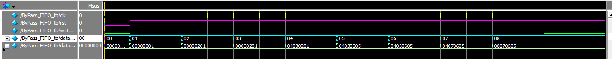

# ByPass FIFO (Look-Ahead / Wrap-Around FIFO)

## 📌 Introduction
This project implements a **ByPass FIFO** (also known as *Look-Ahead FIFO* or *Wrap-Around FIFO*) in SystemVerilog.  
Unlike a normal FIFO, this design incorporates **bypass logic** to make newly written data **immediately available at the output** in the same clock cycle without waiting for it to be stored and read back.

This reduces the latency typically observed in a standard FIFO implementation, making it useful for **low-latency pipelines** in digital systems.

---

## 🔹 What is a ByPass / Look-Ahead / Wrap-Around FIFO?

### Normal FIFO
- Stores data in a queue-like structure.
- Has **read** and **write pointers**.
- When data is written, it is only available at the **read pointer** after the next clock cycle.
- This introduces **one-cycle latency** when the FIFO is empty and a new word is written.

### ByPass (Look-Ahead) FIFO
- In addition to the storage array, it has **bypass logic**.
- If a write occurs and the output is requested in the same cycle:
  - The data is **forwarded (bypassed)** directly to the output.  
  - No additional latency is introduced.
- Often called **First Word Fall-Through (FWFT)** FIFO in industry (Xilinx, Intel/Altera IPs).
- Enables **zero-cycle read latency** for the first word.

### Wrap-Around Behavior
- The write pointer wraps back to `0` after reaching `DEPTH-1`, reusing the storage memory.
- This creates a **circular buffer**.

---

## 🔹 Applications
ByPass FIFOs are widely used in:
- **AXI-Stream / data pipelines** where latency must be minimized.
- **Network packet buffers** to provide immediate access to arriving data.
- **CPU/SoC pipelines** where stall cycles must be avoided.
- **Real-time streaming systems** (audio, video, sensor interfaces).

---

## 📂 Project Structure
├── ByPass_FIFO.sv # SystemVerilog implementation of ByPass FIFO
├── ByPass_FIFO_tb.sv # Testbench with stimulus
├── waveform.png # Simulation results (GTKWave / ModelSim screenshot)
└── README.md # Documentation (this file)

---

## 🔹 Code Details

### Parameters
- `DEPTH` – Number of storage entries in the FIFO (default = 4).
- `WIDTH` – Bit width of each data entry (default = 8).

### Ports
- **Inputs**
  - `clk` – System clock.
  - `rst` – Active-low reset.
  - `write_en` – Write enable.
  - `data_in [WIDTH-1:0]` – Input data.
- **Outputs**
  - `data_out [WIDTH*DEPTH-1:0]` – Parallel output of entire buffer contents.

### Internal Signals
- `buffer [0:DEPTH-1]` – Storage array.
- `write_pointer` – Points to the current write position.
- **ByPass Logic** – For each buffer slot:
  ```systemverilog
  assign data_out[...] =
      (write_en && (write_pointer == i)) ? data_in : buffer[i];
This ensures the latest written data is visible immediately at the output.

---

## 🔹 Simulation

### Testbench
The testbench:
- Applies reset.
- Continuously writes values `1, 2, 3, ...` into the FIFO.
- Demonstrates wrap-around behavior after `DEPTH` writes.
- Shows bypass behavior (new data immediately visible at `data_out`).

### Expected Behavior
- **On reset**: all entries = `0`.
- **During writes**:
  - The FIFO stores new values in circular fashion.
  - Outputs show the most recent data **without extra latency**.

---

## 📊 Simulation Results
Below is the waveform captured from simulation:


### Observations:
- At each `posedge clk` when `write_en = 1`, `data_in` is:
  - Written into the buffer.
  - **Immediately visible** at the corresponding position in `data_out` (*bypass effect*).
- The `write_pointer` wraps around after reaching the end of the buffer (`DEPTH-1 → 0`).
- No cycle delay between writing `data_in` and observing it at `data_out`.

---

## ✅ Conclusion
- This project demonstrates a **ByPass FIFO** (Look-Ahead FIFO) with wrap-around pointer logic.
- It improves over normal FIFOs by providing **zero-cycle latency** for newly written data.
- Such designs are crucial in **high-performance digital systems** where latency must be minimized.
