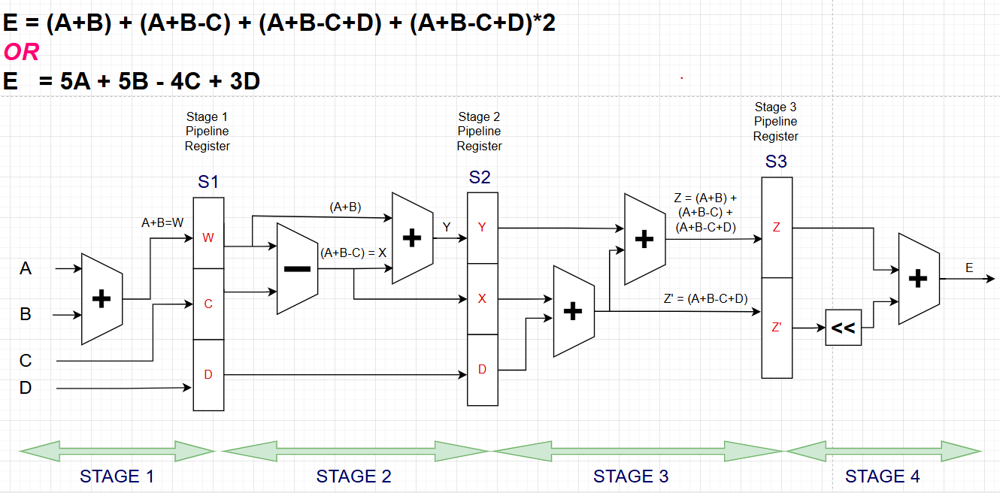
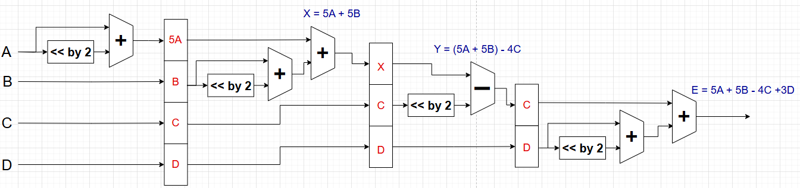
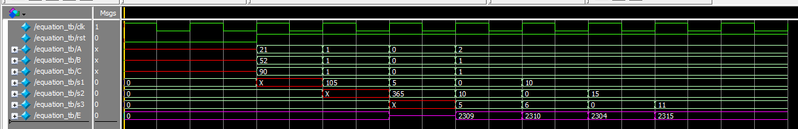
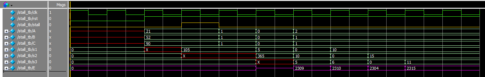

# 4-Stage Pipelined Arithmetic Expression Processor

## Project Overview
This project was assigned by **Sir Ali Raza** to explore the concept of **pipelining** in digital systems.  
We first studied:
- What pipelining is?
- Why it is used in digital systems?  
  (e.g., to increase throughput, improve performance, and allow multiple operations to overlap in execution).  

The task was to implement the following arithmetic expression using a **4-stage pipelined design**:

\[
E = (A+B) + (A+B-C) + (A+B-C+D) + (A+B-C+D) \times 2
\]

---

## Method 1: Direct Expression Expansion
In the first approach, we mapped the equation **as given** into pipeline stages.  

**Pipeline Breakdown:**
1. **Stage 1:** Compute \( A + B \), forward C and D.  
2. **Stage 2:** Compute \( (A + B - C) \).  
3. **Stage 3:** Compute \( (A + B - C + D) \).  
4. **Stage 4:** Combine all partial results into final \( E \).  

### 🔹 Pipeline Diagram (Method 1)

---

## Method 2: Simplified Equation
While analyzing, we realized that the expression can be algebraically simplified:

\[
E = 5A + 5B - 4C + 3D
\]

This form significantly reduces **hardware complexity** while producing the same result.  

### 🔹 Pipeline Diagram (Method 2)

### 🔹 Pipeline Breakdown (Method 2)
1. **Stage 1:** Compute \( 5A \), pass B, C, D forward.  
2. **Stage 2:** Compute \( 5B \), add to \( 5A \).  
3. **Stage 3:** Compute \( -4C \), add to partial result.  
4. **Stage 4:** Compute \( +3D \), finalize \( E \).  

Both architectural diagrams (Method 1 & Method 2) were prepared and compared.

---

## RTL Implementation

### `equation.sv`
- Implements **Method 2** in a **4-stage pipelined RTL**.  
- Each stage has its **own registers** to hold intermediate values.  
- Shifting is used instead of multipliers:
  - \( 5A = (A << 2) + A \)  
  - \( 5B = (B << 2) + B \)  
  - \( 4C = (C << 2) \)  
  - \( 3D = (D << 1) + D \)  
- Final equation computed:
  \[
  E = 5A + 5B - 4C + 3D
  \]

### Stage Registers
- **Stage 1:** Holds \( 5A, B, C, D \).  
- **Stage 2:** Holds \( 5A+5B, C, D \).  
- **Stage 3:** Holds \( 5A+5B-4C, D \).  
- **Stage 4:** Computes final output.  

---

## Testbenches

### `equation_tb.sv`
- Provides multiple test cases for inputs \( A, B, C \).  
- Uses a **clock generator** and synchronous reset.  
- Example test case:  
  - \( A=21, B=52, C=90 \)  
  - Expected output: **E = 2309**  
- Verifies that results appear after correct pipeline latency.  

---

## Stall Functionality

Later, another feature was added: a **stall signal**.  

### `stall.sv`
- Same functionality as `equation.sv` but with an additional **stall input**.  
- When `stall = 1`, all pipeline registers **hold their values** (pipeline is frozen).  
- When `stall = 0`, normal pipelined execution resumes.  

### `stall_tb.sv`
- Testbench verifies that output is correctly **delayed/frozen** when stall is asserted.  
- Example:  
  - Input values are applied, stall is raised for a few cycles → pipeline stops progressing.  
  - Once stall is released, computation resumes without errors.  

---

## Simulation Results
✅ The simulation was run in ModelSim.  
✅ Results matched the expected values for all test cases.  

| Test Case | A  | B  | C  | Expected E | Result |
|-----------|----|----|----|------------|--------|
| 1         | 21 | 52 | 90 | 2309       | ✅      |
| 2         | 1  | 1  | 1  | 2310       | ✅      |
| 3         | 0  | 0  | 0  | 2304       | ✅      |
| 4         | 2  | 1  | 1  | 2315       | ✅      |

---

## 📖 Key Learnings
- **Pipeline design methodology** and its importance in digital systems.  
- How to **map arithmetic equations** into multiple pipeline stages.  
- The benefit of **simplification of logic** before implementation.  
- Writing **SystemVerilog RTL** with structured stage registers.  
- Implementing a **stall mechanism** to handle hazards and pipeline freezing.  
- Testing and verifying hardware designs using **SystemVerilog testbenches**.  

---

## 📌 Files in the Repository
- `equation.sv` → RTL for simplified Method 2.  
- `equation_tb.sv` → Testbench for equation module.  
- `stall.sv` → RTL with stall functionality.  
- `stall_tb.sv` → Testbench for stall-enabled pipeline.  
- Pipeline diagrams for both Method 1 and Method 2.  
- Simulation result screenshots.  

---

## 👩‍💻 Author
**Neha Nauman Khan**  
B.E. Computer & Information Systems Engineering  
NED University of Engineering & Technology
