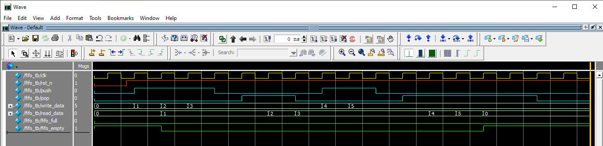

# First-Word Fall-Through (FWFT) FIFO Implementation

## Overview
This repository contains a Verilog implementation of a synchronous First-Word Fall-Through (FWFT) FIFO with configurable width and depth. The design includes a comprehensive testbench for verification.

## What is a First-Word Fall-Through FIFO?
A First-Word Fall-Through (FWFT) FIFO, also known as a "look-ahead" FIFO, is a variation where the first word written to the FIFO immediately appears at the output without requiring a read operation. This differs from standard FIFOs where you need to assert the read signal to get the first data word.

### Key Characteristics:
- Data becomes available on `read_data` as soon as it's written (when FIFO is empty)
- No need for an initial `pop` operation to see the first word
- Subsequent words still require `pop` operations to advance the FIFO

### Common Use Cases:
- Data pipelines where immediate availability of first word reduces latency
- Interfaces between clock domains where receiver needs immediate access
- Systems where the consumer cannot generate read requests immediately
- DSP applications where pipeline stalls must be minimized

## Implementation Details

### Module Parameters
| Parameter | Description                          | Default Value |
|-----------|--------------------------------------|---------------|
| WIDTH     | Bit width of FIFO data               | 8             |
| DEPTH     | Number of entries in FIFO            | 8             |

### Port Description
| Signal       | Direction | Width      | Description                              |
|--------------|-----------|------------|------------------------------------------|
| clk          | input     | 1          | Clock signal                             |
| rst_n        | input     | 1          | Active-low asynchronous reset            |
| pop          | input     | 1          | Read request signal                      |
| push         | input     | 1          | Write request signal                     |
| write_data   | input     | WIDTH      | Data to be written into FIFO             |
| read_data    | output    | WIDTH      | Data output from FIFO (FWFT)             |
| fifo_full    | output    | 1          | FIFO full status flag                    |
| fifo_empty   | output    | 1          | FIFO empty status flag                   |

### Design Implementation
1. **Memory Buffer**: 
   - Implemented as a register array of size DEPTH × WIDTH
   - Initialized to zero on reset

2. **Pointers**:
   - Read and write pointers with wrap-around behavior
   - Width: `$clog2(DEPTH)` bits each

3. **Counter Logic**:
   - Tracks number of elements in FIFO (0 to DEPTH)
   - Handles simultaneous push/pop operations

4. **Status Flags**:
   - `fifo_empty` asserted when count == 0
   - `fifo_full` asserted when count == DEPTH

5. **FWFT Behavior**:
   - Current read data always available on `read_data` output
   - No need for pop operation to see first word

## Testbench Features

### Verification Approach
1. **Reset Testing**: Verifies proper initialization
2. **Basic Push/Pop**: Tests single write/read operations
3. **Full/Empty Conditions**: Exercises boundary cases
4. **Concurrent Operations**: Tests simultaneous push/pop
5. **Wrap-around**: Verifies pointer behavior at boundaries
6. **Randomized Testing**: Stress tests with random operations

### Key Testbench Components
1. Clock and reset generation
2. Randomized stimulus generation
3. Reference model for expected behavior
4. Scoreboard for automatic checking
5. Coverage collection
6. Waveform dumping for debugging

## Simulation Results

The simulation output (provided as PNG) shows:
- Correct FWFT behavior (data appears without pop)
- Proper full/empty flag generation
- Correct pointer wrap-around
- Accurate count updates
- Handling of concurrent push/pop operations

## How to Run Simulation
1. Compile RTL and testbench with your preferred Verilog simulator
2. Run simulation with waveform dumping enabled
3. Verify all test cases pass
4. Check coverage metrics

## Dependencies
- Verilog simulator (ModelSim, VCS, Riviera-PRO, etc.)
- Waveform viewer for debugging

## Future Enhancements
1. Add almost full/empty flags
2. Implement synchronous reset version
3. Add error detection (overflow/underflow)
4. Create parameterized pipeline stages version
5. Add CDC capabilities for asynchronous FIFO version